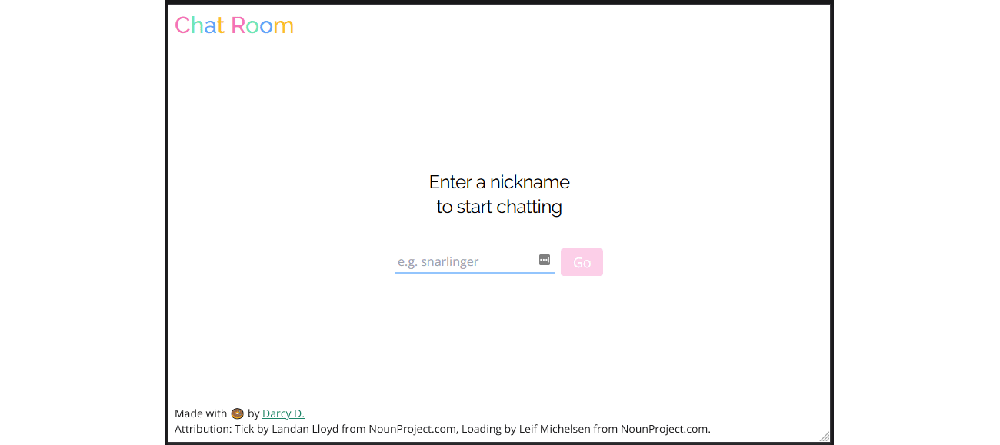

# 🦝 chat-room

A little chat room I'm making with Vue, Tailwind, MySQL, and PHP. I'm using it to strengthen my web development and general software engineering skills.

Here's what I have so far:



⭐ [See the project hub.](https://github.com/darcydriscoll/chat-room/wiki)

⭐ [See the user story map.](https://miro.com/app/board/o9J_l-DFRFo=/)

⭐ [See the user stories Kanban board.](https://github.com/darcydriscoll/chat-room/projects/1)

## 🦄 Project setup
```
npm install
```

### 💣 Compiles and hot-reloads for development
```
npm run serve
```

### 💣 Compiles and minifies for production
```
npm run build
```

### 💣 Lints and fixes files
```
npm run lint
```

### 💣 Customize configuration
See [Configuration Reference](https://cli.vuejs.org/config/).
